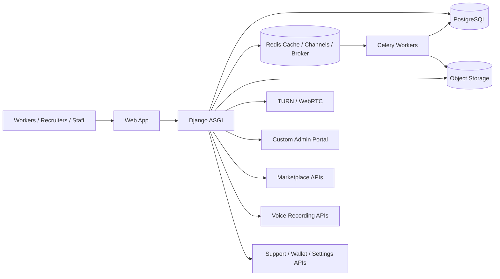

# Enterprise Marketplace Architecture

## Scope

The platform has been extended from a voice-recording product into a modular freelancing marketplace that supports:

- Voice recording sessions
- Recruiter-driven jobs and task categories
- Application and submission workflows
- Wallets, withdrawals, and recharge plan masters
- Support tickets with SLA tracking
- Dynamic settings and notification templates
- A custom staff portal in place of the default Django admin UI

## Database Design

### Identity and profiles

- `accounts.CustomUser`
- `marketplace.MarketplaceProfile`
- `presence.UserPresence`
- `accounts.EmailOTP`
- `accounts.LoginHistory`
- `accounts.DeviceTracking`
- `accounts.KYCDocument`

### Marketplace

- `marketplace.MarketplaceCategory`
- `marketplace.JobPosting`
- `marketplace.JobMedia`
- `marketplace.JobApplication`
- `marketplace.JobSubmission`
- `marketplace.SavedJob`
- `marketplace.JobFollow`
- `marketplace.RecruiterFollow`

### Settings and analytics

- `marketplace.DynamicSetting`
- `marketplace.NotificationTemplate`
- `marketplace.AnalyticsSnapshot`

### Wallet and finance

- `wallet.Wallet`
- `wallet.Transaction`
- `wallet.EarningRate`
- `wallet.Withdrawal`
- `wallet.BonusCampaign`
- `wallet.RechargeOperator`
- `wallet.RechargePlan`
- `wallet.RechargeOrder`

### Support and trust

- `support.SupportTicket`
- `support.TicketReply`
- `core.AuditLog`
- `core.Achievement`
- `core.UserAchievement`
- `core.Referral`
- `core.WeeklyChallenge`
- `core.UserChallengeProgress`

## Folder Structure

```text
apps/
  accounts/
  core/
  drive/
  marketplace/
  notifications/
  presence/
  ratings/
  recordings/
  support/
  wallet/
config/
  settings/
docs/
static/
templates/
  accounts/
  dashboard/
  marketing/
  marketplace/
  portal/
  recordings/
  support/
  wallet/
```

## Services Layer

- `apps.marketplace.repositories.MarketplaceRepository`
- `apps.marketplace.services.MarketplaceService`
- `apps.marketplace.tasks`
- `apps.wallet.views` for recharge and reporting endpoints

The repository layer isolates reads used by the portal and dashboards. The service layer owns workflows such as applying to jobs, submitting work, toggling saves/follows, and awarding XP.

## Redis and Celery

- Redis remains the cache backend and channel layer backend.
- Celery workers handle metrics snapshots, job cleanup, payout jobs, and notification fan-out.
- The `AnalyticsSnapshot` model stores daily portal snapshots for charts and auditability.

## Deployment Strategy

### Recommended topology

- Django ASGI app behind Nginx or a managed load balancer
- One Redis cluster for cache, channels, and Celery broker separation by database index
- PostgreSQL for production persistence
- Celery worker and Celery beat as separate processes
- Object storage for uploaded files and recordings
- Optional TURN server for WebRTC media sessions

### Scaling notes

- Keep portal charts on cached snapshots instead of live heavy aggregation.
- Push expensive earnings and ranking jobs into Celery.
- Use `select_related` and `prefetch_related` for list endpoints.
- Store extensible job configuration in JSON fields so categories and job types can evolve without schema churn.

## Production Architecture Diagram



## Operational Defaults

- Custom portal is exposed at `/admin/`
- Marketplace UI is exposed at `/jobs/`
- Public marketing pages are exposed at `/about/`, `/pricing/`, `/faq/`, and related routes
- The old default Django admin UI is no longer routed
